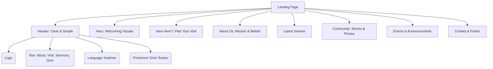

# Product Requirements Document: Grace Church Baku Website

**Version:** 1.1
**Date:** 2025-06-30
**Author:** Roo (AI Product Manager)

## 1. Vision & Mission

### 1.1. Vision
To create a modern, warm, and inspiring digital home for Grace Church Baku that serves as a welcoming "visit card" for curious newcomers, a central hub for the existing congregation, and a window into our mission for international supporters.

### 1.2. Mission Statement
"Grace" Church is dedicated to proclaiming the Gospel of Jesus Christ’s "Finished Work" and sharing the message of God’s grace throughout Baku and across the regions of Azerbaijan.

## 2. Target Audience

The website must cater to three primary user personas:

*   **The Seeker (New Local Visitor):** Individuals in Baku and surrounding areas who are curious about Christianity or looking for a church community. They are likely visiting for the first time and need to quickly understand who we are, what we believe, and how to connect.
*   **The Member (Existing Congregation):** Regular attendees of Grace Church Baku. They need practical information like announcements, event schedules, and resources to deepen their faith (sermons, devotionals).
*   **The Supporter (International Partner):** Individuals or organizations outside Azerbaijan who are invested in the church's mission. They want to see the impact of their support through stories and updates and understand the church's needs.

## 3. Design & Tone

*   **Modern & Clean:** The design should be visually appealing, uncluttered, and easy to navigate on both desktop and mobile devices.
*   **Warm & Welcoming:** Use a color palette, imagery, and typography that evokes a sense of community, peace, and invitation. It should feel "cozy" and personal, not corporate.
*   **Inspiring & Mission-Focused:** The design and content should clearly and passionately communicate the church's mission and the transformative power of the gospel, using powerful stories and visuals.

## 4. Features

### 4.1. Phase 1: The Landing Page (MVP) - Completed

The initial launch is a comprehensive, single-page website containing the following sections:

*   **Header:**
    *   **Logo:** Grace Church Baku logo implemented.
    *   **Navigation:** Simple, clear links to page sections.
    *   **Language Switcher:** Functional UI for Azerbaijani, Russian, and English.
    *   **Give Button:** A clear and accessible "Give" button.
*   **Welcome/Hero Section:** A compelling, high-quality background image with a welcoming headline and the church's mission statement.
*   **New Here? / Plan Your Visit:** A dedicated section for newcomers.
    *   **Service Times & Location:** Clearly stated times with an embedded, mobile-friendly map showing the correct address.
    *   **What to Expect:** A friendly overview of the service.
    *   **Call to Action:** A "Plan Your Visit" button linking to the contact form.
*   **About Us (Mission & Beliefs):** A concise section summarizing the church's purpose and core beliefs.
*   **Latest Sermon:** A preview of the most recent sermon with a high-quality thumbnail, title, speaker, and a "Watch Now" button.
*   **Community (Stories):** A section featuring a compelling photo and a short quote or story from a member.
*   **Events & Announcements:** A simple, easy-to-update section for the most important upcoming events.
*   **Contact & Footer:**
    *   A functional contact form.
    *   Contact information (email, phone), and social media links (Facebook, YouTube, Instagram, TikTok) sourced from a central `contacts.json` file.

### 4.2. Phase 2: Future Features

The following features will be developed as part of a multi-page site after the initial launch.

*   **Backend Integration:**
    *   Deploy to Vercel.
    *   Connect Supabase for database and authentication.
*   **Multilingual Content:**
    *   Translate all content into Azerbaijani, Russian, and English.
    *   Implement logic to display content based on the selected language.
*   **About Us (Expanded):**
    *   **Our Beliefs:** A detailed page on theological distinctives.
    *   **Leadership:** A page introducing the pastors and key leaders.
*   **Full Sermon Archive:** A dedicated, searchable page for all sermon recordings, synchronized with the Grace Church Baku YouTube channel.
*   **Events Calendar:** A full calendar for all church events with filtering options.
*   **Ministries Pages:** Dedicated pages for key ministries.
*   **Resources:**
    *   **Daily Devotionals Blog:** A blog for daily messages.
    *   **Daily Bible Readings:** A resource page with passages in all three languages.
*   **Online Giving:** A secure, dedicated portal for online donations.
*   **Admin Dashboard:** A secure area for leaders to update announcements, blogs, events, and other content.

## 5. Technical Requirements

*   **Framework:** Next.js with TypeScript.
*   **Styling:** Tailwind CSS with a custom theme.
*   **Components:** `shadcn/ui` and custom components.
*   **Animation:** Framer Motion.
*   **Responsive Design:** Fully responsive for all devices.
*   **Multilingual Support:** Implemented with a UI selector, with full content translation pending.
*   **Content Management:** Centralized `contacts.json` for easy updates. Future development will use a headless CMS or Supabase.

## 6. Success Metrics

*   **Engagement:** Number of new inquiries through the contact form.
*   **Reach:** Views and clicks on the sermon archive links.
*   **Community:** Feedback from church members on the website's usefulness.